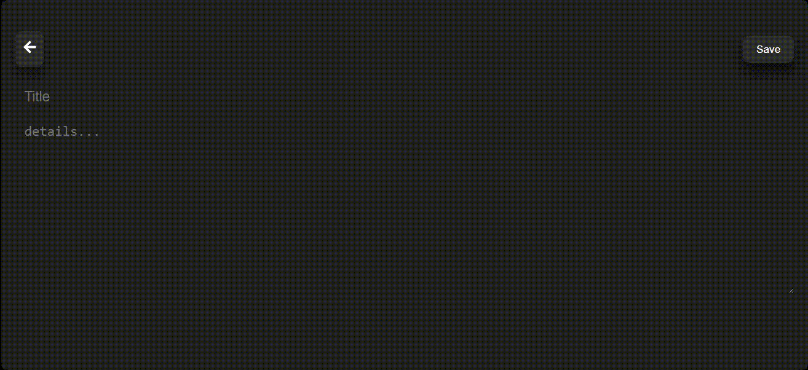

# Note Taking App

A simple React application for taking and managing notes. Create, edit, and view your notes seamlessly.

## Table of Contents

- [Overview](#overview)
- [Features](#features)
- [Libraries](#libraries)
- [Getting Started](#getting-started)
- [Usage](#usage)
- [Gif](#gif)


## Overview

This React application serves as a note-taking system, allowing users to create, edit, and view their notes. The app utilizes React Router for navigation, `react-icons` for iconography, `uuid` for generating unique identifiers, and local storage to persist notes across sessions.

## Features

- **View Notes:** Navigate to the home page to view all existing notes.

- **Create Note:** Visit the "Create Note" page to add a new note to your collection.

- **Edit Note:** Access the "Edit Note" page to modify the content of an existing note.

## Libraries

The following libraries are used in this project:

- **React:** A JavaScript library for building user interfaces.
- **React Router:** A library for navigation in React applications.
- **react-icons:** A library for including popular icon sets in React projects.
- **uuid:** A library for generating unique identifiers.
- **LocalStorage:** A web storage solution for persisting data locally.

## Getting Started

Follow these steps to set up the project on your local machine:

1. **Clone the Repository:**

    ```bash
    git clone https://github.com/your-username/note-taking-app.git
    ```

2. **Install Dependencies:**

    ```bash
    cd note-taking-app
    npm install
    ```

3. **Run the Development Server:**

    ```bash
    npm start
    ```

4. **Open in Browser:**

    Open [http://localhost:3000](http://localhost:3000) in your web browser to access the application.

## Usage

1. **View Notes:**
   - Open the home page to view a list of all existing notes.

2. **Create Note:**
   - Navigate to the "Create Note" page.
   - Enter the content of your new note and click "Save" to add it to your collection.

3. **Edit Note:**
   - Go to the "Edit Note" page by clicking on the note you wish to modify.
   - Update the content and click "Save" to apply the changes.

## Screenshots

